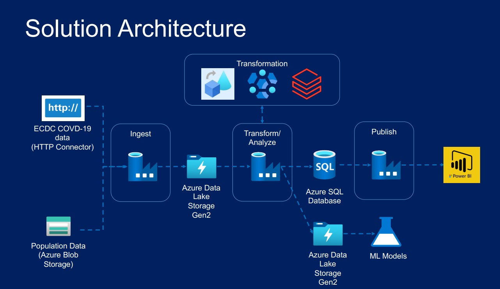

# Covid Prediction/Reporting

A comprehensive data engineering project that predicts and reports COVID-19 data using Azure technologies and Power BI.

## Solution Architecture


## Overview
This project demonstrates the end-to-end data engineering process for ingesting, transforming, and visualizing COVID-19 data.

## Technologies Used
- **Azure Data Factory (ADF)**: Data ingestion and transformation.
- **Azure Data Lake Storage (ADLS Gen 2)**: Centralized data storage.
- **Azure SQL Database**: Storing structured data.
- **Azure HDInsight**: Advanced transformations and processing.
- **Azure Databricks**: Data transformation and analysis.
- **Power BI**: Data visualization and reporting.

## Data Sources
- **ECDC Website**: COVID data ingestion using the HTTP connector.
- **Azure Blob Storage**: Supplemental data ingestion.

## Workflow
1. **Data Ingestion**:
   - Imported COVID data from the ECDC website using ADF HTTP connector.
   - Uploaded supplementary data to Azure Blob Storage and ingested into ADLS Gen 2 using ADF.
2. **Data Transformation**:
   - Used ADF to clean and transform data.
   - Leveraged Databricks for advanced transformations and HDInsight for specific use cases.
3. **Data Storage**:
   - Stored cleaned data in ADLS Gen 2 for reporting.
   - Structured data saved in Azure SQL Database for analysis.
4. **Reporting**:
   - Published datasets to Power BI for visualization and insights.

## Features
- Automated pipeline for data ingestion and transformation.
- Scalable architecture using Azure services.
- Real-time insights into COVID data trends.

## How to Run the Project
1. Set up Azure resources as outlined in the architecture diagram.
2. Configure the ADF pipelines and Dataflows with your credentials.
3. Upload data files to Azure Blob Storage if applicable.
4. Execute the pipelines to process and store data.
5. Open Power BI reports for visualization.

## Solution Architecture Diagram
- Ensure the image file `solution-architecture.png` is uploaded in the repository.

---

### How to Add the Architecture Image
1. Place your architecture image (e.g., `solution-architecture.png`) in the project folder.
2. Upload it to the GitHub repository with other files.
3. Use the Markdown syntax in the README to link the image:
   ```markdown
   
